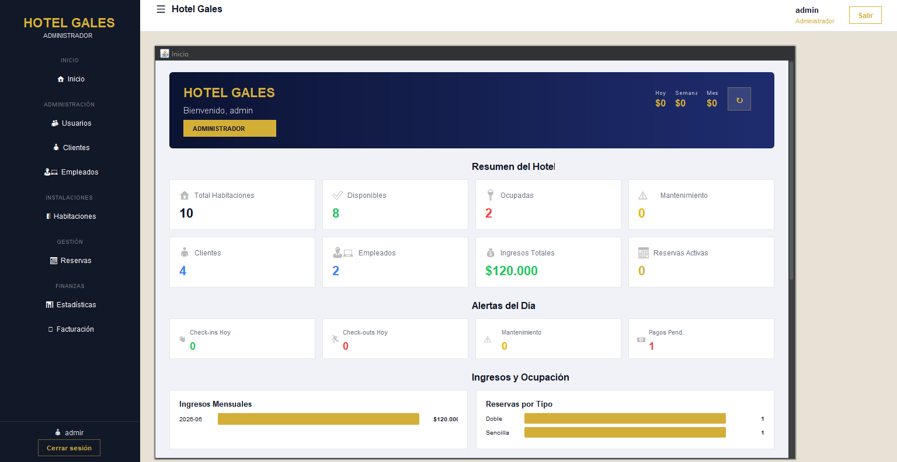
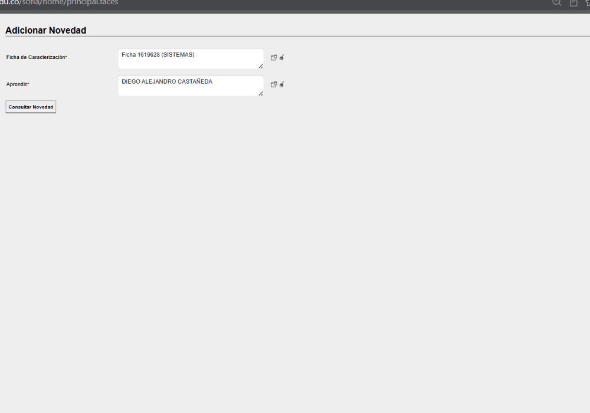
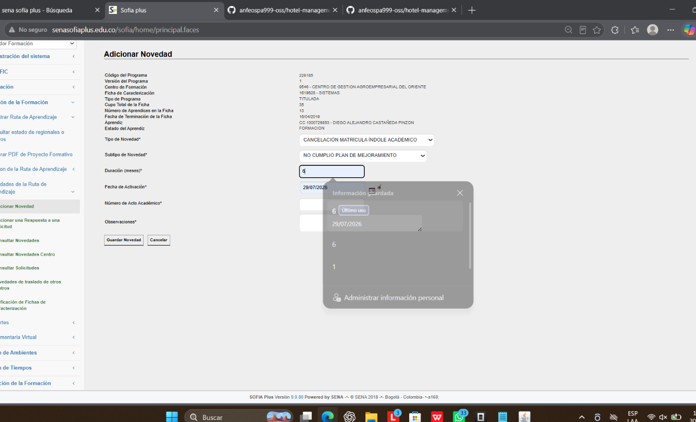
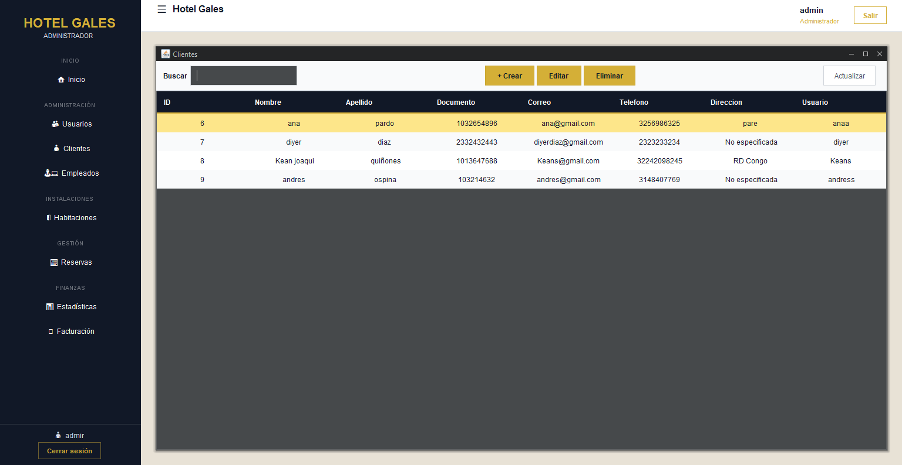
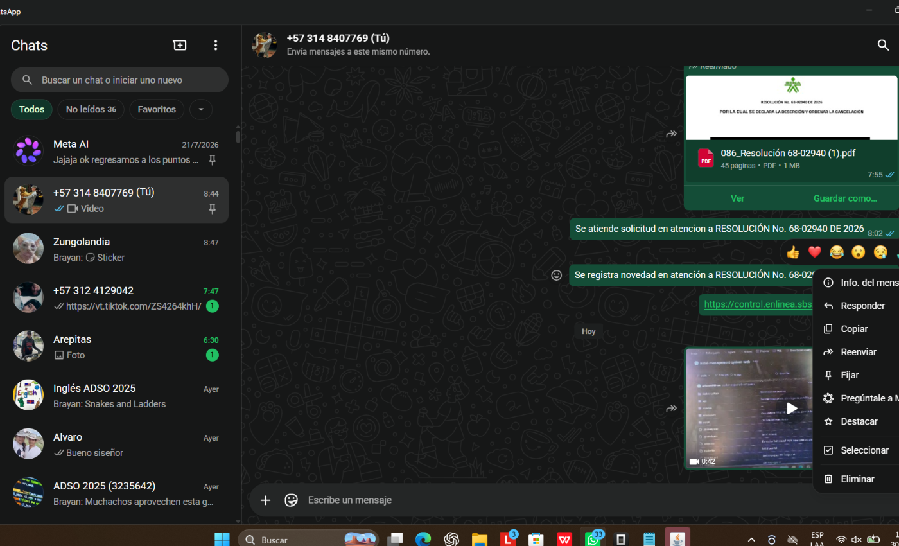
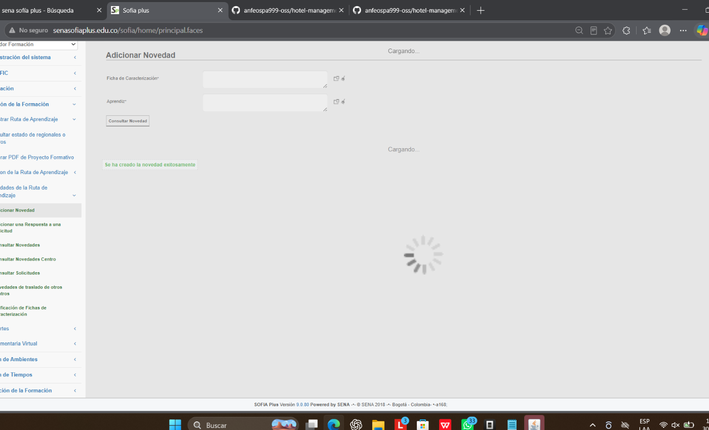
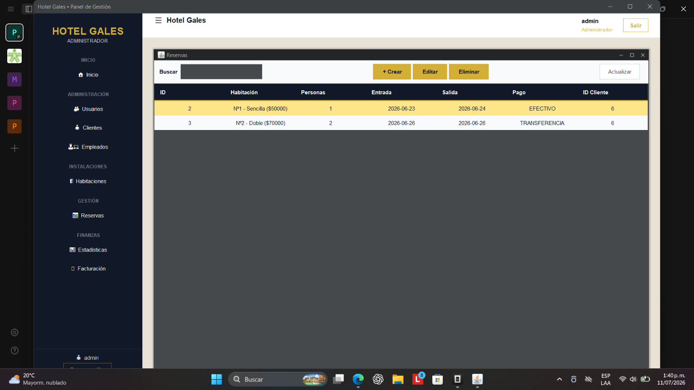
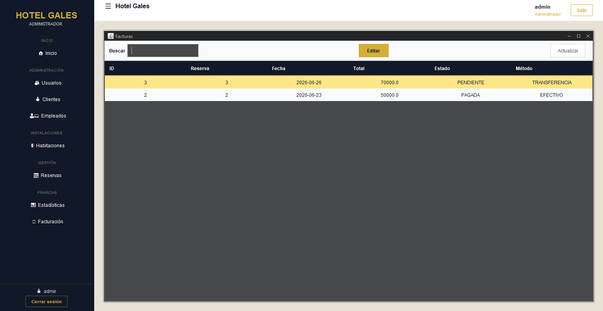

<div align="center">

# 🏨 Hotel Gales — Sistema de Gestión Hotelera


> **Repositorio:** [github.com/anfeospa999-oss/hotel-management-system-desktop](https://github.com/anfeospa999-oss/hotel-management-system-desktop)

---

| 🌐 Versión Web | 🖥️ Versión de Escritorio |
|:---|:---|
| **Tecnologías** | **Tecnologías** |
| • Flask | • Java 24 |
| • PostgreSQL | • PostgreSQL |
| • Bootstrap | • Swing |
| • HTML / CSS / JavaScript | • Apache NetBeans |
| **Repositorio** | **Repositorio** |
| [github.com/anfeospa999-oss/hotel-management-system-web](https://github.com/anfeospa999-oss/hotel-management-system-web) | Este repositorio |

```
                 HOTEL GALES
                       │
          ┌────────────┴────────────┐
          │                         │
    Desktop Java              Portal Web
    (Escritorio)                (Web)
```

*Dos plataformas. Un mismo sistema. Una sola identidad.*

</div>

---

## 📑 Índice

- [Descripción General](#-descripción-general)
- [¿Por qué este proyecto?](#-por-qué-este-proyecto)
- [Características principales](#-características-principales)
- [Demo](#-demo)
- [Información del Proyecto](#-información-del-proyecto)
- [Tecnologías](#-tecnologías)
- [Funcionalidades](#-funcionalidades)
- [Capturas del Sistema](#-capturas-del-sistema)
- [Arquitectura](#-arquitectura)
- [Estructura del Proyecto](#-estructura-del-proyecto)
- [Configuración Rápida](#-configuración-rápida)
- [Roadmap](#-roadmap)
- [Estado del Proyecto](#-estado-del-proyecto)
- [Próximas Mejoras](#-próximas-mejoras)
- [Equipo de Desarrollo](#-equipo-de-desarrollo)
- [Mi Participación](#-mi-participación)
- [Licencia](#-licencia)

---

## 📖 Descripción General

**Hotel Gales** es un sistema de gestión hotelera de escritorio construido con **Java 24** y **Swing**, utilizando **NetBeans 24** como IDE y **PostgreSQL 16** como motor de base de datos. La interfaz gráfica utiliza **FlatLaf 3.4** (FlatDarkLaf) para un aspecto moderno y profesional con una paleta de colores dorado (`#C9A84C`) y azul marino (`#0F2137`).

El sistema implementa una arquitectura **MVC (Modelo-Vista-Controlador)** con autenticación por roles (administrador, recepcionista, cliente), permitiendo gestionar clientes, empleados, habitaciones, reservas y facturación desde una interfaz unificada tipo **MDI (Multiple Document Interface)** con escritorio virtual y barra lateral navegable.

Desarrollado como proyecto académico durante la formación en Análisis y Desarrollo de Software del **SENA**.

---

## 💡 ¿Por qué este proyecto?

Este sistema nació como proyecto académico del **SENA** con el objetivo de automatizar los procesos de gestión hotelera: registro de clientes y empleados, administración de habitaciones, reservas y facturación, todo desde una interfaz de escritorio moderna. La aplicación fue diseñada para ser utilizada por hoteles pequeños y medianos que necesitan una solución integral, accesible y fácil de usar, con una identidad visual premium que refleje la calidad del servicio.

---

### ✨ Características principales

✔ Arquitectura MVC        &nbsp;&nbsp;&nbsp;&nbsp; ✔ Autenticación por roles  
✔ Dashboard de estadísticas &nbsp;&nbsp;&nbsp;&nbsp; ✔ CRUD completo  
✔ Facturación automática   &nbsp;&nbsp;&nbsp;&nbsp; ✔ PostgreSQL  
✔ FlatLaf moderno          &nbsp;&nbsp;&nbsp;&nbsp; ✔ Portal Web complementario

---

<p align="center">
  
  <br>
  <em>Panel de control principal del sistema</em>
</p>

---

## 🎥 Demo


> Vista rápida del funcionamiento del sistema. *(Agrega aquí un GIF animado del sistema en funcionamiento)*

---

## 📊 Información del Proyecto

| Ítem | Detalle |
|:-----|:--------|
| ☕ **Java** | JDK 24 |
| 🖥️ **NetBeans** | 24 |
| 🗄️ **Base de Datos** | PostgreSQL 16 |
| 📦 **Clases** | 36 (10 controladores + 8 modelos + 16 vistas + 2 utilidades) |
| 🧩 **Módulos** | 9 (Usuarios, Clientes, Empleados, Habitaciones, Tipos Hab., Reservas, Facturas, Estadísticas, Login) |
| 🪟 **Ventanas/Formularios** | 14 (1 login, 1 registro, 1 principal, 1 stats, 1 frame genérico, 9 diálogos CRUD) |
| 👥 **Roles de Usuario** | 3 (Administrador, Recepcionista, Cliente) |
| 🗓️ **Commits** | 44+ |

---

## 🛠 Tecnologías

<div align="center">

| Categoría | Tecnología |
|:----------|:-----------|
| **Backend** | Java 24 |
| **Interfaz** | Swing + FlatLaf (FlatDarkLaf) |
| **Base de datos** | PostgreSQL 16 |
| **IDE** | Apache NetBeans 24 |
| **Arquitectura** | MVC |
| **Control BD** | JDBC |

</div>

---

## ⚙️ Funcionalidades

### 🔐 Autenticación y Roles

- **Login** con credenciales cifradas (SHA-256) y opción "Recordarme"
- **Registro** de nuevos usuarios con creación automática de perfil cliente
- **Tres roles** con permisos diferenciados:
  - **Administrador**: acceso completo a todos los módulos
  - **Recepcionista**: gestión de reservas, clientes, habitaciones y facturación
  - **Cliente**: consulta de sus propias reservas y facturas

### 📊 Panel de Estadísticas (Dashboard)

- Hero con bienvenida, badge de rol e ingresos del día/semana/mes
- **Tarjetas resumen**: total habitaciones, disponibles, ocupadas, mantenimiento, clientes, empleados, ingresos totales, reservas activas
- **Alertas del día**: check-ins hoy, check-outs hoy, mantenimiento, pagos pendientes
- **Gráficos de barras**: ingresos mensuales (12 meses), reservas por tipo de habitación
- **Tablas**: próximas reservas (7 días), últimas facturas
- Botón **↻ Refrescar** para recargar datos en segundo plano (SwingWorker)

### 👥 Gestión de Usuarios (Admin)

- CRUD completo de usuarios del sistema
- Asignación de rol (administrador, recepcionista, cliente)
- Contraseñas cifradas con SHA-256

### 👤 Gestión de Clientes

- CRUD completo con tabla filtrable
- Vista combinada con nombre de usuario (LEFT JOIN)
- Auto-creación de cuenta de usuario al registrar cliente
- Campos: nombre, apellido, documento, correo, teléfono, dirección, usuario, contraseña

### 👨‍💼 Gestión de Empleados

- CRUD completo con formato de salario en pesos colombianos
- Validación de campos con bordes rojos
- Auto-creación de cuenta de usuario
- Campos: nombre, apellido, documento, cargo/rol, salario, fecha ingreso, teléfono, correo, dirección, usuario, contraseña

### 🚪 Gestión de Habitaciones

- CRUD completo con tabla filtrable
- Estados: DISPONIBLE, OCUPADA, MANTENIMIENTO
- Asignación de tipo de habitación y precio por noche
- Cambio automático de estado al crear reservas

### 🏷️ Tipos de Habitación

- CRUD de categorías (Sencilla, Doble, Suite, Matrimonial, etc.)
- Nombre y descripción

### 📅 Gestión de Reservas

- CRUD completo con selectores de cliente y habitación (cargados desde BD)
- Selección de número de personas (1–8)
- Medios de pago: EFECTIVO, TRANSFERENCIA
- Fechas con selector de calendario (JSpinner DateEditor)
- Auto-generación de factura al crear reserva
- Cambio automático de estado de habitación a OCUPADA

### 🧾 Facturación

- Tabla con columna de acciones "Ver Factura" (botón dorado)
- Diálogo de detalle con información de factura, huésped y estadía
- Botón "Marcar como Pagada" para facturas pendientes
- Factura auto-generada desde la reserva (cálculo: noches × precio habitación)
- Estados: PENDIENTE, PAGADA, CANCELADA, ANULADA, PROCESADA

### 🎨 Interfaz de Usuario

- FlatLaf (FlatDarkLaf) con paleta dorado/azul marino
- Sidebar colapsable con secciones por rol
- Topbar con badge de usuario/rol y botón de salir
- Tablas con cabeceras oscuras y búsqueda filtro
- Notificaciones tipo toast (success, error, warning, confirm)
- Botones consistentes con estilos dorados

### 🌐 Portal Web (Extra)

- Portal web complementario que forma parte del ecosistema Hotel Gales y permite el acceso desde navegador
- Diseño premium con la identidad visual del hotel
- Versión web del mismo sistema, enfocada en acceso de personal

---

## 📸 Capturas del Sistema

| Pantalla | Vista |
|:---------|:------|
| **Inicio de Sesión** |  |
| **Dashboard / Estadísticas** |  |
| **Usuarios (CRUD)** |  |
| **Clientes (CRUD)** |  |
| **Empleados (CRUD)** |  |
| **Habitaciones (CRUD)** |  |
| **Reservas (CRUD)** |  |
| **Facturación** |  |

---

## 🏗 Arquitectura

El proyecto sigue el patrón **MVC (Modelo-Vista-Controlador)** con tres capas bien definidas:

```
┌──────────────┐     ┌──────────────┐     ┌──────────────┐
│   VISTA      │◄───►│ CONTROLADOR  │◄───►│   MODELO     │
│  (Swing)     │     │  (Lógica)    │     │  (JDBC/SQL)  │
└──────────────┘     └──────────────┘     └──────┬───────┘
                                                   │
                                           ┌───────▼───────┐
                                           │  PostgreSQL   │
                                           └───────────────┘
```

- **Modelo** (`modelo/`): Clases Java que encapsulan los datos y operaciones SQL directas contra PostgreSQL mediante JDBC. Cada tabla tiene su clase modelo con métodos `Listar()`, `insertar()`, `modificar()`, `eliminar()`, `buscar()`.
- **Controlador** (`Controlador/`): Orquesta la lógica de negocio, conecta la vista con el modelo, carga datos en tablas y maneja validaciones.
- **Vista** (`vista/`): Interfaces gráficas construidas con Swing (JFrame, JDialog, JInternalFrame, JPanel). Incluye formularios, tablas con filtros, notificaciones toast y un escritorio virtual MDI.

La base de datos se auto-crea al iniciar la aplicación mediante `ConexionBD.inicializarEsquema()`, que ejecuta sentencias `CREATE TABLE IF NOT EXISTS`. Las credenciales se configuran vía variables de entorno o valores por defecto.

---

## 📁 Estructura del Proyecto

```
ProyectoHotel/
├── build.xml                  # Script Ant de NetBeans
├── manifest.mf                # Manifiesto del JAR
├── db_changes.sql             # Migraciones manuales
├── screenshots/               # Capturas del sistema
├── web/                       # Portal web complementario
│   ├── index.html
│   ├── css/
│   └── js/
├── lib/                       # Librerías
│   ├── flatlaf-3.4.jar
│   └── postgresql-42.7.11.jar
├── dist/                      # Distribución
│   └── ProyectoHotel.jar
├── src/
│   ├── Controlador/           # Capa de lógica de negocio
│   │   ├── ControladorLogin.java
│   │   ├── ControladorRegistroUsuario.java
│   │   ├── ControladorUsuario.java
│   │   ├── ControladorCliente.java
│   │   ├── ControladorEmpleado.java
│   │   ├── ControladorHabitaciones.java
│   │   ├── ControladorTipoHabitacion.java
│   │   ├── ControladorReserva.java
│   │   ├── ControladorFacturas.java
│   │   └── ControladorEstadisticas.java
│   ├── modelo/                # Capa de datos / SQL
│   │   ├── ConexionBD.java
│   │   ├── Login.java
│   │   ├── Cliente.java
│   │   ├── empleado.java
│   │   ├── Habitaciones.java
│   │   ├── TipoHabitacion.java
│   │   ├── Reserva.java
│   │   └── facturas.java
│   ├── vista/                 # Capa de interfaz gráfica
│   │   ├── MDILogin.java          → Login principal (entry point)
│   │   ├── MDIRegistroUsuario.java → Registro de usuarios
│   │   ├── VentanaPrincipal.java   → Dashboard MDI + sidebar
│   │   ├── PanelEstadisticas.java  → Estadísticas / Dashboard
│   │   ├── ModuleListInternalFrame → Marco genérico CRUD
│   │   ├── DialogCliente.java      → CRUD Cliente
│   │   ├── DialogEmpleado.java     → CRUD Empleado
│   │   ├── DialogHabitacion.java   → CRUD Habitación
│   │   ├── DialogReserva.java      → CRUD Reserva
│   │   ├── DialogFactura.java      → Detalle Factura
│   │   ├── DialogUsuario.java      → CRUD Usuario
│   │   ├── DialogTipoHabitacion.java → CRUD Tipo Habitación
│   │   ├── CardPanel.java          → Tarjeta para stats
│   │   ├── RoundedButton.java      → Botón personalizado
│   │   ├── TableHeaderRenderer.java → Cabecera de tabla
│   │   └── ToastNotifier.java → NOTA: está en util/
│   ├── util/                  # Utilidades
│   │   ├── Encriptador.java
│   │   └── ToastNotifier.java
│   ├── Imagenes/              # Recursos gráficos
│   │   ├── ImagenFondoLogin.png
│   │   ├── ImagenFondoLogin2.png
│   │   ├── Login3.png
│   │   └── imagen login 4.png
│   └── org/                   # Layout absoluto NetBeans
│       └── netbeans/lib/awtextra/
└── nbproject/                 # Configuración NetBeans
    └── project.properties
```

---

## ⚡ Configuración Rápida

### Requisitos Previos

- **Java JDK 24** o superior ([Descargar](https://jdk.java.net/))
- **Apache NetBeans 24** ([Descargar](https://netbeans.apache.org/))
- **PostgreSQL 16** o servidor PostgreSQL accesible

### Pasos

1. **Clonar el repositorio**
   ```bash
   git clone https://github.com/anfeospa999-oss/hotel-management-system-desktop.git
   ```

2. **Abrir en NetBeans**
   - NetBeans → File → Open Project → Seleccionar `ProyectoHotel`

3. **Verificar librerías**
   - Las librerías están en `lib/`:
     - `flatlaf-3.4.jar` → FlatLaf Look and Feel
     - `postgresql-42.7.11.jar` → Driver PostgreSQL

4. **Configurar base de datos**
   - Las credenciales se configuran vía variables de entorno o system properties:
     - `HOTEL_DB_URL` → `jdbc:postgresql://IP:PUERTO/BD`
     - `HOTEL_DB_USER` → usuario PostgreSQL
     - `HOTEL_DB_PASSWORD` → contraseña
   - Por defecto apunta al servidor remoto configurado en `ConexionBD.java`

5. **Ejecutar**
   - Click derecho sobre el proyecto → Run
   - La clase principal es `vista.MDILogin`
   - Usuario por defecto: `admin` / `admin123`

---

## 📈 Roadmap

| Versión | Estado | Hitos |
|:--------|:-------|:------|
| **v1.0** | ✅ | Login, autenticación por roles, registro de usuarios |
| **v1.1** | ✅ | CRUD completo (clientes, empleados, habitaciones, reservas) |
| **v1.2** | ✅ | Dashboard de estadísticas con gráficos y alertas |
| **v1.3** | ✅ | Facturación automática y portal web complementario |
| **v1.4** | 🚧 | Reportes exportables a PDF y Excel |
| **v2.0** | 🔲 | Calendario visual de reservas y notificaciones en tiempo real |

---

## 📈 Estado del Proyecto

✅ **Desarrollo activo**

✔ CRUD completos &nbsp;&nbsp;&nbsp;&nbsp; ✔ Dashboard de estadísticas  
✔ Facturación automática &nbsp;&nbsp;&nbsp;&nbsp; ✔ Portal Web complementario

🚧 **Próximamente**

🔲 Exportación a PDF &nbsp;&nbsp;&nbsp;&nbsp; 🔲 Exportación a Excel  
🔲 Calendario visual &nbsp;&nbsp;&nbsp;&nbsp; 🔲 Notificaciones en tiempo real

---

## 🚀 Próximas Mejoras

- [ ] Módulo de limpieza y mantenimiento con asignación de tareas
- [ ] Reportes exportables a PDF y Excel
- [ ] Gestión de consumos y servicios adicionales
- [ ] Calendario visual de reservas (vista mensual/semanal)
- [ ] Notificaciones en tiempo real (check-ins, check-outs)
- [ ] Módulo de comentarios y valoraciones de clientes
- [ ] Integración con pasarela de pagos
- [ ] Modo oscuro/claro configurable por usuario
- [ ] Historial de cambios y auditoría
- [ ] Multilenguaje (Español/Inglés) — base ya implementada en portal web

---

## 👨‍💻 Equipo de Desarrollo

Proyecto desarrollado como parte del programa de formación del **SENA** (Servicio Nacional de Aprendizaje) — Análisis y Desarrollo de Software.

| Integrante | Rol | Contribuciones |
|:-----------|:----|:---------------|
| **Andres Felipe Ospina** | Desarrollador | Dashboard/Estadísticas, UI/UX, Facturación, Portal Web, Refactorización general |
| **Juan Sar2107** | Desarrollador | Modelos, Controladores, CRUDs base, Base de datos, Lógica de negocio |
| **Diyer Diaz** | Desarrollador | Modelos iniciales, Estructura del proyecto, Commit inicial |

---

## 🚀 Mi Participación (Andres Felipe Ospina)

Como parte del equipo de desarrollo, mis contribuciones se enfocaron en la modernización de la interfaz, la implementación del dashboard de estadísticas y la mejora continua de la experiencia de usuario:

### Interfaz y Experiencia de Usuario

- Diseño e implementación de la paleta de colores dorado/azul marino con **FlatLaf (FlatDarkLaf)**
- Sidebar responsiva colapsable con secciones por rol (administrador, recepcionista, cliente)
- Topbar profesional con badge de usuario/rol y botón de cierre de sesión
- Cabeceras de tabla con fondo oscuro y texto blanco
- Botones con estilos dorados, bordes suaves y efectos hover
- Tablas con color de selección sólido (sin transparencia)

### Dashboard de Estadísticas

- Panel de estadísticas completo con tarjetas resumen, gráficos de barras y tablas
- Consultas SQL en tiempo real agrupadas por período (día, semana, mes, 12 meses)
- Alertas del día: check-ins, check-outs, mantenimiento, pagos pendientes
- Carga asíncrona con `SwingWorker` para no bloquear la interfaz
- Botón de refrescar con recarga en segundo plano

### Módulo de Facturación

- Rediseño del diálogo de detalle de factura con secciones claras
- Botón "Marcar como Pagada" con cambio de estado en base de datos
- Botón "Ver Factura" estilizado en la tabla de facturas

### Mejoras en Formularios CRUD

- Selectores de cliente y habitación cargados desde base de datos en reservas
- Selector de fecha con calendario (`JSpinner DateEditor`)
- Formato de salario en pesos colombianos con filtro de entrada
- Validación visual con bordes rojos en campos requeridos
- Auto-creación de cuentas de usuario al registrar clientes y empleados

### Sistema de Notificaciones

- Clase `ToastNotifier` con notificaciones estilo toast (success, error, warning)
- Diálogo de confirmación estilizado para acciones destructivas
- Integración en todos los formularios CRUD

### Portal Web

- Portal web responsivo que forma parte del ecosistema Hotel Gales
- Diseño premium con la identidad visual del hotel y selectores de idioma
- Versión web del mismo sistema, accesible desde cualquier navegador

---

## 📄 Licencia

Este proyecto fue desarrollado con fines académicos durante la formación como Tecnólogo en Análisis y Desarrollo de Software del SENA. Puede utilizarse como referencia para fines educativos respetando los créditos de los autores.

---

<p align="center">
  <strong>Hotel Gales</strong><br>
  <sub>Sistema de Gestión Hotelera de Escritorio</sub><br><br>
  Versión de escritorio del ecosistema Hotel Gales.<br>
  Proyecto hermano de la <a href="https://github.com/anfeospa999-oss/hotel-management-system-web">versión web</a>.<br><br>
  Hotel Gales forma parte de un ecosistema compuesto por una<br>
  aplicación web y una aplicación de escritorio que comparten<br>
  la misma identidad visual y funcional.<br><br>
  Desarrollado con ❤️ para el SENA — Colombia 🇨🇴
</p>
